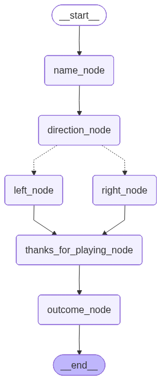

**Start App**
```
uv run python main.py
```

__Kill the server an re-start it between each curl to confirm state is maintained__


**Simulate Slack Events**

```bash 

curl -s -X POST http://localhost:8000/message \
  -H 'Content-Type: application/json' \
  -d '{"text":"hi","thread_ts":"42"}' | jq


curl -s -X POST http://localhost:8000/message \
  -H 'Content-Type: application/json' \
  -d '{"text":"Alex","thread_ts":"42"}' | jq


curl -s -X POST http://localhost:8000/message \
  -H 'Content-Type: application/json' \
  -d '{"text":"forward","thread_ts":"42"}' | jq


curl -s -X POST http://localhost:8000/message \
  -H 'Content-Type: application/json' \
  -d '{"text":"left","thread_ts":"42"}' | jq


```


